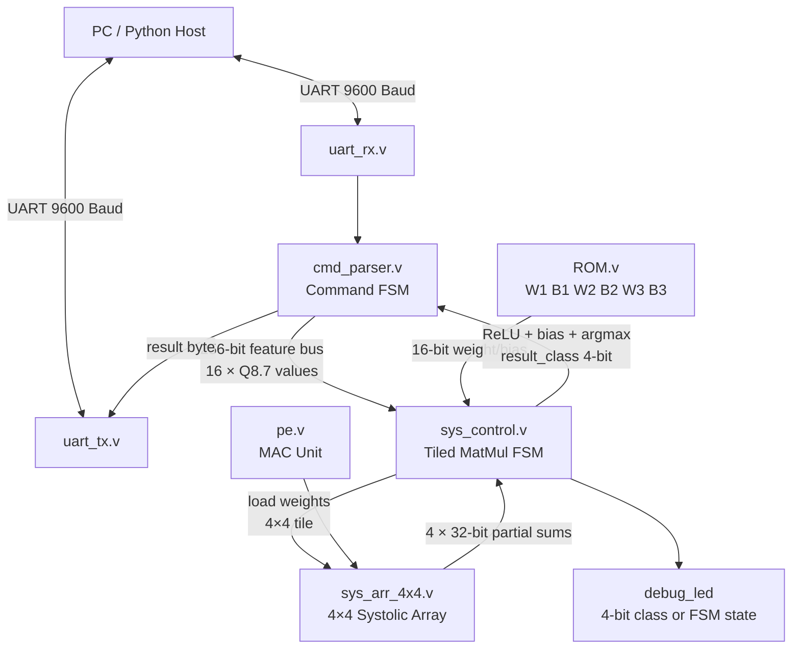

<div align="center">


<a href="https://github.com/DenverCoder1/readme-typing-svg">
  
</a>

<p align="center">
  <strong>
    A fully custom hardware neural network accelerator written in Verilog,
    implementing a quantized 3-layer MLP for digit classification on a Basys 3 FPGA.
    Features a 4×4 weight-stationary systolic array, on-chip weight ROM,
    and a UART command interface for PC-driven inference.
  </strong>
</p>

<p align="center">
  
  
  
  
  
  
</p>
</div>

---

# ⚡ FPGA MLP Accelerator

This project implements a complete hardware neural network inference engine on FPGA. A 3-layer Multi-Layer Perceptron (MLP) trained in PyTorch is quantized into Q8.7 fixed-point arithmetic and executed directly on custom RTL hardware using a **Weight-Stationary Systolic Array** architecture.

The entire compute stack — from UART byte reception to argmax output — is implemented in Verilog and runs on a **Basys 3 (Artix-7)** FPGA at **100 MHz**. The host PC sends 16 feature values over UART and receives the predicted class index back in a single transaction.

---

# 🧠 Project Highlights

- 3-layer MLP inference fully in hardware: 16 → 32 → 16 → 10
- 4×4 weight-stationary systolic array with diagonal input skewing
- Q8.7 fixed-point quantization (16-bit activations, 32-bit accumulators)
- On-chip weight ROM loaded from `.mem` files at synthesis time
- Tiled matrix-multiply controller handling all three layers automatically
- ReLU activation applied in hardware after each hidden layer
- Pipelined hardware argmax over 10 output neurons
- UART command protocol (9600 baud) with fault-injection support
- Debug LEDs showing inference state and final predicted class
- Modular test tops for incremental hardware validation

---

# 🛠 Tech Stack

<div align="center">
  <a href="https://skillicons.dev">
    
  </a>
  <br><br>
  
  
  
  
  
  
</div>

---

# 🏗 Hardware Architecture

The accelerator is composed of six tightly integrated hardware subsystems:



---

# 📐 Network Topology

| Layer | Type | Input Neurons | Output Neurons | Activation | ROM Region |
|-------|------|:---:|:---:|:---:|---|
| L1 | Fully Connected | 16 | 32 | ReLU | W1 `[0..511]`, B1 `[512..543]` |
| L2 | Fully Connected | 32 | 16 | ReLU | W2 `[544..1055]`, B2 `[1056..1071]` |
| L3 | Fully Connected | 16 | 10 | — (argmax) | W3 `[1072..1231]`, B3 `[1232..1241]` |

All weights and biases are stored in a single unified ROM of **1242 × 16-bit** entries, initialised at synthesis using `$readmemh` from six `.mem` files.

---

# 📦 Module Reference

```
.
├── uart_rx.v          # UART receiver — 16× oversampled, double-synchronised async input
├── uart_tx.v          # UART transmitter — 10-bit frame (start + 8 data + stop)
├── uart_echo.v        # Echo loopback top — used to validate UART hardware
├── cmd_parser.v       # Command protocol FSM — decodes CMD_START / CMD_RESULT / CMD_FAULT
├── pe.v               # Processing Element — pipelined 16×16→32-bit MAC with weight register
├── sys_arr_4x4.v      # 4×4 systolic array — diagonal input skewing, 7-cycle pipeline
├── sys_control.v      # Tiled matrix-multiply controller — manages all 3 layers end-to-end
├── ROM.v              # Unified weight ROM — 1242 entries, loaded from .mem files
├── mlp_top.v          # Full MLP top-level — UART + parser + ROM + ctrl + SA + LEDs
├── top_uart_test.v    # Test top: UART + cmd_parser only (pre-SA integration)
├── test_top.v         # Test top: UART + ROM readback over serial
└── test_top2.v        # Test top: UART + raw systolic array (manual weight/input loading)
```

---

## `pe.v` — Processing Element

The atomic compute unit. Each PE holds one stationary weight and computes a multiply-accumulate every clock cycle. Activations flow rightward through the array; partial sums flow downward.

```
         act_in  ──────────────────► act_out
                        │
                   weight (latched)
                        │
         psum_in ──► [ × + ] ──────► psum_out
```

| Parameter | Default | Description |
|-----------|:-------:|-------------|
| `DATA_W` | 16 | Activation / weight width (bits) |
| `ACC_W` | 32 | Accumulator / partial-sum width (bits) |

---

## `sys_arr_4x4.v` — Systolic Array

Arranges 16 PE instances in a 4×4 grid. Input rows are staggered by one cycle each (diagonal skewing) so that a full 4-element activation vector is aligned with every column of stationary weights.

- **Weight loading:** addressed by `(load_row, load_col)`, one cell at a time
- **Pipeline depth:** `2N − 1 = 7` cycles for a 4×4 array
- **Done signal:** single-cycle pulse after cycle 7

---

## `sys_control.v` — Tiled Matrix-Multiply Controller

The most complex module. Orchestrates all three MLP layers by iterating over 4×4 tiles of the weight matrix, accumulating partial sums, then applying bias and ReLU before writing results to the activation buffer for the next layer.

**FSM states:** `IDLE → LOAD_TILE → WAIT_START → RUN_TILE → WAIT_BIAS0 → WAIT_BIAS1 → APPLY_BIAS → DONE_ALL → WAIT_ARGMAX`

**Fixed-point arithmetic:**
- Layer 1 bias is pre-shifted left by 14 to match the Q8.7 accumulator scale, then right-shifted by 14 post-addition
- Layers 2 & 3 use a shift of 7
- Saturation to `[−32768, 32767]` before ReLU

**Argmax:** a 3-stage pipelined tournament tree over 10 outputs produces the predicted class index with no software involvement.

---

## `cmd_parser.v` — Command Protocol FSM

Decodes a simple binary protocol sent over UART:

| Command | Byte | Payload | Response |
|---------|:----:|---------|----------|
| `CMD_START` | `0x01` | 32 bytes (16 × 16-bit features, little-endian) | `0xAA` ACK |
| `CMD_RESULT` | `0x02` | — | 1 byte predicted class `[0..9]` |
| `CMD_FAULT` | `0xFA` | 2 bytes (target + bit position) | — |

Features arrive as 16-bit words split across two consecutive bytes. Once all 16 words are received, `start_inference` pulses for one clock cycle.

The fault-injection interface (`fault_armed`, `fault_target`, `fault_bit_pos`) arms a bit-flip on a specified bit position of a weight or activation, useful for reliability and SEU testing.

---

## `ROM.v` — Unified Weight ROM

A 1242-entry synchronous ROM initialised from six hex memory files at synthesis:

```verilog
$readmemh("w1.mem", mem, 0,    511 );   // Layer 1 weights  — 16×32 = 512 entries
$readmemh("b1.mem", mem, 512,  543 );   // Layer 1 biases   — 32 entries
$readmemh("w2.mem", mem, 544,  1055);   // Layer 2 weights  — 32×16 = 512 entries
$readmemh("b2.mem", mem, 1056, 1071);   // Layer 2 biases   — 16 entries
$readmemh("w3.mem", mem, 1072, 1231);   // Layer 3 weights  — 16×10 = 160 entries
$readmemh("b3.mem", mem, 1232, 1241);   // Layer 3 biases   — 10 entries
```

All values are Q8.7 signed 16-bit fixed-point, matching the quantisation applied in PyTorch.

---

# 🔌 UART Protocol

```
HOST                                       FPGA
 │                                           │
 │── 0x01 ─────────────────────────────────►│  CMD_START
 │── byte[0] lo ... byte[31] hi ───────────►│  16 × 16-bit features
 │◄─ 0xAA ────────────────────────────────── │  ACK (image received, inference running)
 │                                           │
 │   (wait for inference to complete)        │
 │                                           │
 │── 0x02 ─────────────────────────────────►│  CMD_RESULT
 │◄─ class[3:0] ──────────────────────────── │  Predicted digit 0–9
 │                                           │
```

UART parameters: **9600 baud, 8N1, 100 MHz system clock**. The receiver uses 16× oversampling with a double-synchroniser on the async input line.

---

# 🧪 Test Tops

Three separate top-level modules allow incremental, isolated hardware testing:

| Module | Purpose | Key Command |
|--------|---------|-------------|
| `uart_echo.v` | Loopback — echoes every received byte back | Any byte |
| `test_top.v` (`rom_test_top`) | Reads any ROM address over UART | `0x03` + 2 addr bytes |
| `test_top2.v` (`sa_test_top`) | Loads weights and inputs, runs the systolic array, streams raw 32-bit results back | `0x10` + 32 weight bytes + 8 input bytes |

This modular approach isolates each subsystem so bugs can be caught before full integration.

---

# 🚀 Getting Started

## Prerequisites

- Vivado (tested on 2024.x)
- Basys 3 board (Artix-7 XC7A35T)
- Python 3 + `pyserial` for the host script
- PyTorch (for quantising and exporting weights to `.mem` files)

## Build & Deploy

1. **Export weights from PyTorch** — quantise your trained model to Q8.7 and generate the six `.mem` files.

2. **Add sources to Vivado** — include all `.v` files and set `mlp_top.v` as the top module.

3. **Place `.mem` files** — copy `w1.mem`, `b1.mem`, `w2.mem`, `b2.mem`, `w3.mem`, `b3.mem` into the project's simulation/synthesis working directory so `$readmemh` can find them.

4. **Set constraints** — apply the Basys 3 XDC file, mapping:
   - `clk` → 100 MHz on-board clock
   - `rst_n` → `BTNC` (active-high, internally inverted)
   - `uart_rx` / `uart_tx` → USB-UART pins
   - `debug_led[3:0]` → `LED[3:0]`

5. **Synthesise, implement, and program** the bitstream.

## Running Inference

```python
import serial, struct

ser = serial.Serial('/dev/ttyUSB1', 9600, timeout=2)

# Send CMD_START + 16 Q8.7 features (little-endian 16-bit each)
features = [...]        # list of 16 float values
q87 = [int(round(f * 128)) for f in features]
payload = b'\x01' + b''.join(struct.pack('<h', v) for v in q87)
ser.write(payload)
ack = ser.read(1)       # expect 0xAA

# Poll for result
ser.write(b'\x02')
result = ser.read(1)
print(f"Predicted class: {result[0]}")
```

---

# 📊 Fixed-Point Quantization

All values use **Q8.7** format: 1 sign bit, 8 integer bits, 7 fractional bits.

| Quantity | Width | Format |
|----------|:-----:|--------|
| Input features | 16-bit | Q8.7 signed |
| Weights & biases | 16-bit | Q8.7 signed |
| Partial sums / accumulators | 32-bit | Q16.14 extended |
| Layer 1 post-bias shift | ÷ 2^14 | back to Q8.7 |
| Layers 2 & 3 post-bias shift | ÷ 2^7 | back to Q8.7 |
| Saturation range | — | [−32768, 32767] |

---

# 🔧 Debug LEDs

The four `debug_led` outputs on `mlp_top` serve a dual purpose:

- **During inference:** `{inference_active, done_state, result_valid, start_inference}` — allows visual tracking of the FSM progress
- **After inference completes:** the latched 4-bit class index is held on the LEDs until the next `CMD_START`

---

# 📁 Repository Structure

```
├── rtl/
│   ├── uart_rx.v
│   ├── uart_tx.v
│   ├── uart_echo.v
│   ├── cmd_parser.v
│   ├── pe.v
│   ├── sys_arr_4x4.v
│   ├── sys_control.v
│   ├── ROM.v
│   ├── mlp_top.v          ← primary top-level
│   ├── top_uart_test.v    ← integration test top
│   ├── test_top.v         ← ROM verification top
│   └── test_top2.v        ← systolic array test top
├── mem/
│   ├── w1.mem  b1.mem
│   ├── w2.mem  b2.mem
│   └── w3.mem  b3.mem
├── scripts/
│   ├── quantize_and_export.py   ← PyTorch → .mem conversion
│   └── infer_uart.py            ← host-side inference script
└── constraints/
    └── basys3.xdc
```

---

<div align="center">

</div>
